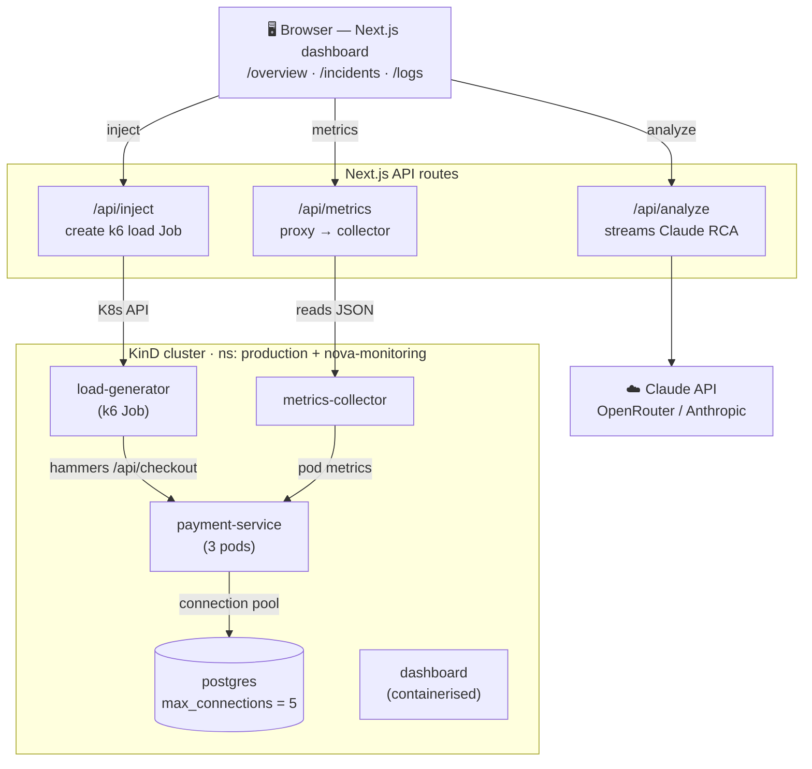
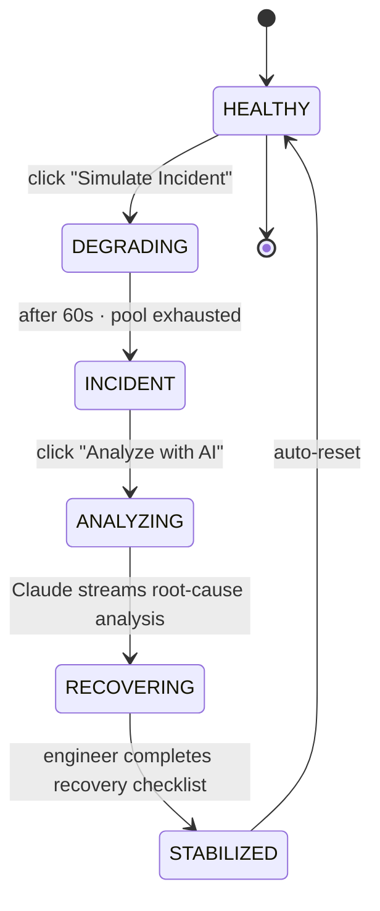

# Nova — AI‑Augmented DevOps Platform

Nova is a **plug‑and‑play, open‑source, AI‑augmented DevOps incident platform**. It reasons
over your **real logs and incidents** to produce root‑cause analyses, a grounded incident
**chat assistant**, and **approve‑to‑run remediation runbooks** — all configured through a
single `nova.config.yaml`.

Everything is pluggable and config‑driven:

- **Logging backend** — Loki or Elasticsearch/OpenSearch (same `LogScope`, no code changes).
- **Persistence** — file store today (Mongo/Postgres/S3 are contract‑ready adapters).
- **AI provider** — OpenRouter / Anthropic (keys stay in env, never in the file).
- **Domain Packs** (`domains/*.yaml`) — swap the vocabulary, services, impact signal and
  severity rules so Nova speaks *your* domain (payments, streaming, generic‑k8s, …).
- **Prompt templates** (`prompts/*.md`) — tune the AI wording without touching code.

Run it three ways: **locally** (`npm run dev`), in **production** (Docker image / Helm
chart / Kubernetes), or via the included **one‑command KinD demo** under
[`examples/kind-demo/`](examples/kind-demo).

---

## Table of contents

- [What it does](#what-it-does)
- [Configuration](#configuration)
- [Running locally](#running-locally)
- [Deploy to production](#deploy-to-production)
  - [Docker](#option-1--docker)
  - [Helm / Kubernetes](#option-2--helm--kubernetes)
- [The included demo (KinD)](#the-included-demo-kind)
- [Adapters & extensibility](#adapters--extensibility)
- [Testing](#testing)
- [Environment variables](#environment-variables)
- [Repository layout](#repository-layout)
- [Architecture](#architecture)
- [Troubleshooting](#troubleshooting)
- [Security](#security-notes)

---

## What it does

Nova turns raw logs + incidents into grounded, actionable output:

- **Root‑cause analysis** — streams a structured RCA (root cause → blast radius →
  remediation → confidence) from an incident's real logs, using the configured AI provider.
- **Incident chat assistant** — answers time‑range and aggregation questions over your
  incident history, RCAs, runbooks, cluster state and eval scores, grounded only in context.
- **Runbooks** — matches an incident to an authored runbook and offers **approve‑to‑run**
  remediation (manual, webhook, or k8s) behind approval + RBAC + audit.
- **Self‑evaluation** — an on‑demand LLM‑as‑judge harness scores the AI's own output against
  a golden dataset and real incidents (config‑driven weights + pass threshold).
- **Read‑only Settings** at `/settings` — shows the resolved config (secrets never displayed).

The bundled demo drives a real `payment-service` in a local KinD cluster into a
connection‑pool cascade so you can watch the whole flow end‑to‑end — but the **core carries
no demo or domain assumptions** (enforced by `test/architecture/no-demo-imports.test.ts`).

---

## Configuration

Nova reads **`nova.config.yaml`** from the working directory (or the path in `$NOVA_CONFIG`).
It's optional — with no file, built‑in defaults apply. A partial file is fine; every unset
field inherits its default. Start from [`nova.config.example.yaml`](nova.config.example.yaml).

**Secrets never live in the file.** Reference them with `${ENV_VAR}` (with an optional
`${VAR:-fallback}`) and provide the value via the environment:

```yaml
logs:
  provider: loki                 # loki | elasticsearch | opensearch
  url: ${LOKI_URL:-http://loki:3100}
  scope:                         # where Nova looks for logs (backend-neutral)
    include: [{ namespace: production }]
    exclude: [{ service: load-generator }]
persistence:
  provider: file                 # file (Mongo/Postgres/S3 are adapter-ready)
  seed: none                     # 'none' = start empty; 'demo' = bundled sample history
ai:
  provider: openrouter           # openrouter | anthropic | openai | azure | ollama
  apiKeyEnv: OPENROUTER_API_KEY  # the ENV VAR name — the key stays in env
# domain: ./domains/payments.yaml  # optional Domain Pack (else the built-in default)
features:
  chat: true
  eval: true
  autoRemediation: false
```

- **Domain Packs** live in [`domains/`](domains) and are selected with `domain:`. They set the
  glossary, service catalog, impact signal, severity rules and prompt wording — swapping one
  file re‑domains Nova with no code change.
- **Prompt templates** live in [`prompts/`](prompts) (`triage.md`, `rca.md`, `chat-system.md`,
  `judge.md`) and are referenced under `prompts:` in the config.
- The full surface is documented inline in `nova.config.example.yaml`.

---

## Running locally

```bash
npm install

# Optional: start from the example config (defaults work without it)
cp nova.config.example.yaml nova.config.yaml

# Optional: an AI key enables RCA/chat (without one, those features report "no key")
export OPENROUTER_API_KEY=sk-...      # or ANTHROPIC_API_KEY

npm run dev                            # http://localhost:3000  → /overview
```

What works without extra setup:

- **No config file** → defaults load (Loki at `http://loki:3100`, file store, payments‑reference domain).
- **No AI key** → the dashboard runs; AI actions return a clear "no key configured" message.
- **No log backend reachable** → `/api/logs` returns `{ fallback: true }` and the UI degrades gracefully.

Useful scripts: `npm run build` (production build), `npm run typecheck`, `npm test`.

---

## Deploy to production

Nova is a stateless Next.js server (standalone output) on port **3000**. It needs three things:

1. A **config** (`nova.config.yaml`, mounted or baked in) pointing at your log backend.
2. **Secrets** in the environment (AI key + any backend credentials).
3. **Persistence** — a volume for the file store at `/data` (`DATA_DIR`), or a database
   adapter once configured.

The `prompts/` and `domains/` folders are **baked into the image** (traced into the Next.js
standalone output), so they ship automatically.

### Option 1 — Docker

```bash
# Build (multi-stage; produces a small standalone runtime image)
docker build -t your-org/nova:0.1.0 .

# Run
docker run --rm -p 3000:3000 \
  -e OPENROUTER_API_KEY=sk-... \
  -e LOKI_URL=http://loki.observability:3100 \
  -e NOVA_CONFIG=/app/nova.config.yaml \
  -v "$PWD/nova.config.yaml:/app/nova.config.yaml:ro" \
  -v nova-data:/data \
  your-org/nova:0.1.0
```

Open http://localhost:3000/overview.

### Option 2 — Helm / Kubernetes

A production Helm chart ships in [`deploy/helm/nova`](deploy/helm/nova):

```bash
# 1. Build & push the image to your registry
docker build -t ghcr.io/your-org/nova:0.1.0 .
docker push ghcr.io/your-org/nova:0.1.0

# 2. Install — pass the AI key (or point at an existing Secret) and your config
helm install nova deploy/helm/nova \
  --namespace nova --create-namespace \
  --set image.repository=ghcr.io/your-org/nova \
  --set image.tag=0.1.0 \
  --set secret.data.OPENROUTER_API_KEY=sk-... \
  --set-string novaConfig.logs.url='http://loki.observability:3100'
```

The chart provides:

| Concern | How |
|---|---|
| **Config** | `values.novaConfig` is rendered to a ConfigMap and mounted at `/app/nova.config.yaml`; changing it rolls the pods (config checksum annotation). |
| **Secrets** | Set `secret.data.*` (chart creates a Secret) **or** `secret.existingSecret: my-secret` to reference your own. Injected via `envFrom`. |
| **Persistence** | `persistence.enabled` creates a PVC mounted at `/data` for the file store. Disable it when you configure a database adapter. |
| **Networking** | `service` (ClusterIP by default) + optional `ingress` (host + TLS). |
| **Security** | Runs as non‑root uid 1001 with `fsGroup` so it can write `/data`. |

Recommended production settings: `persistence.enabled: true`, `novaConfig.persistence.seed: none`
(start empty, driven by live incidents), and reference AI/backend secrets via
`secret.existingSecret`. See [`deploy/helm/nova/values.yaml`](deploy/helm/nova/values.yaml)
for every option.

> Prefer plain manifests? `helm template nova deploy/helm/nova -f my-values.yaml | kubectl apply -f -`.

---

## The included demo (KinD)

The full local demo (a real `payment-service`, Postgres, Loki, Grafana, load generator, and
the incident cascade) lives entirely under [`examples/kind-demo/`](examples/kind-demo) and is
driven by the scripts in [`examples/kind-demo/scripts/`](examples/kind-demo/scripts). It is **not** part of the core product.


## Architecture



> Renders natively on GitHub. In VS Code, install the **Markdown Preview Mermaid Support**
> extension to see it in the built‑in preview.

- **`payment-service`** opens a deliberately tiny DB pool (`max: 2`) against a Postgres
  capped at `max_connections=5`. Under load it exhausts connections, returns 503s, and its
  `/health` probe starts failing → Kubernetes restarts pods (visible `CrashLoopBackOff`).
- **`metrics-collector`** polls the K8s API every 3s and aggregates pods into per‑service
  metrics/health/status (CPU, ready/crashed pods, deployments). Pod **logs** are no longer
  collected here.
- **`fluent-bit`** (DaemonSet) tails every node's container logs, keeps the `production`
  namespace, and ships them to **`loki`** labelled `{namespace, app}`. The dashboard queries
  Loki via LogQL for incident RCA and the `/api/logs` viewer; **`grafana`** (at
  `https://grafana`, via Caddy) sits on the same store for manual deep-dives.
- **`alertmanager`** + the Loki **ruler** provide the autonomous log-driven detection path:
  an ERROR spike fires an alert that webhooks `/api/alerts` to open an incident.
- **`dashboard`** reads metrics through `/api/metrics` and logs through `/api/logs`, and shows a
  `LIVE` badge when the backends are reachable, `SIMULATED`/`OFFLINE` otherwise.

---

## Repository layout

**🖥️ Dashboard — Next.js app**

| Path | Description |
|------|-------------|
| `app/page.tsx` | Redirects `/` → `/overview` |
| `app/overview/` | Main dashboard — stats, charts, service health, AI panel |
| `app/incidents/` | Incident list + `/incidents/[id]` detail page |
| `app/logs/` | Live log viewer |
| `app/api/analyze/` | `POST` — streams Claude RCA (OpenRouter / Anthropic) |
| `app/api/metrics/` | `GET` — proxies the metrics-collector |
| `app/api/inject/` | `POST` / `DELETE` — create / stop the k6 load Job |
| `components/dashboard/` | Dashboard UI — charts, tables, incident trigger, AI panel |
| `components/ui/` | shadcn/ui primitives _(left untouched by convention)_ |
| `hooks/` | `use-ai-analysis`, `use-real-metrics` |
| `lib/` | Core logic — `config/` (schema + loader + registry), `logs/` (LogSource adapters + scope), `persistence/` (store + contract), `domain/` (Domain Packs), `ai/` (prompts + context engine), `actions/` (runbook executor), `eval/`, `security/` |

**⚙️ Configuration & packs**

| Path | Description |
|------|-------------|
| `nova.config.example.yaml` | Documented example config (copy to `nova.config.yaml`) |
| `domains/` | Domain Packs — payments, generic‑k8s, streaming (+ authored runbooks) |
| `prompts/` | Editable prompt templates — `triage.md`, `rca.md`, `chat-system.md`, `judge.md` |

**⚙️ Cluster services** _(demo only — relocated under `examples/kind-demo/`)_

| Path | Description |
|------|-------------|
| `examples/kind-demo/metrics-collector/` | Standalone Node/TS service — reads pod metrics |
| `examples/kind-demo/payment-service/` | Node/Express service that crashes under DB connection load |
| `examples/kind-demo/load-generator/` | k6 load test (Docker image) |

**📦 Infra & ops**

| Path | Description |
|------|-------------|
| `deploy/helm/nova/` | Production Helm chart (Deployment, ConfigMap, Secret, PVC, Ingress) |
| `Dockerfile` | Nova server image — Next.js standalone (bakes in `prompts/` + `domains/`) |
| `next.config.mjs` | `output: "standalone"` + file tracing for prompts/domains |
| `k8s/` | Demo Kubernetes manifests (under `examples/kind-demo/`) |
| `scripts/` | Demo orchestration under `examples/kind-demo/scripts/` — `cluster` · `inject-failure` · `recover` · `teardown` |

---

### Demo prerequisites

Beyond **Node.js 20+ / npm**, the KinD demo needs:

- [Docker Desktop](https://www.docker.com/products/docker-desktop/) (running)
- [KinD](https://kind.sigs.k8s.io/) — `brew install kind`
- [kubectl](https://kubernetes.io/docs/tasks/tools/) — `brew install kubectl`

**Optional — trusted `https://nova`:** [mkcert](https://github.com/FiloSottile/mkcert) +
[Caddy](https://caddyserver.com/) (`brew install mkcert caddy`) plus a hosts entry
`sudo sh -c 'echo "127.0.0.1    nova" >> /etc/hosts'`. Without them the demo is still served
at `http://localhost:3000`. Built and tested on **Apple Silicon macOS**.

### Run the demo

### 1. (Optional) configure AI keys for the in‑cluster dashboard

```bash
cp examples/kind-demo/k8s/secret.yaml.template examples/kind-demo/k8s/secret.yaml
# edit examples/kind-demo/k8s/secret.yaml and fill in OPENROUTER_API_KEY and/or ANTHROPIC_API_KEY
```

`examples/kind-demo/k8s/secret.yaml` is git‑ignored. If you skip this, setup creates an empty secret and the AI
panel simply reports that no key is configured.

### 2. Create everything with one command

```bash
./examples/kind-demo/scripts/cluster
```

This is idempotent and will:

1. Check prerequisites (docker, kind, kubectl).
2. Create the `nova-platform` KinD cluster (maps container `:30000` → host `:3000`).
3. Install and patch **metrics-server** for KinD.
4. Create the `production` + `nova-monitoring` namespaces and the `ai-keys` secret.
5. Build the four images (dashboard, payment-service, metrics-collector, load-generator),
   **skipping any whose source hasn't changed** (stamps in `.build-cache/`).
6. `kind load` each image into the cluster (only when rebuilt or missing).
7. Apply all manifests and wait for every deployment to become available.
9. Run `verify`.
9. **Start the dashboard port-forward** on `localhost:3000` in the background — no manual step.
10. If `mkcert` + `caddy` are installed, install the local CA, generate a cert for `nova`
    (only if missing — reused across teardowns), and start **Caddy** to serve
    **https://nova**. Binding port 443 prompts for `sudo`.

### 3. Open the dashboard

`cluster` already started the port-forward (and Caddy, if installed), so just open:

- **https://nova/overview** — if mkcert + Caddy are installed
- **http://localhost:3000/overview** — always available

> Need to (re)start the port-forward manually? `./examples/kind-demo/scripts/port-forward` still works.

### 4. Trigger an incident

```bash
./examples/kind-demo/scripts/inject-failure    # start the k6 load → payment-service degrades in ~20–30s
# …watch the dashboard go red, open INC-2847, click "Analyze with AI", work the checklist…
./examples/kind-demo/scripts/recover           # stop load + scale payment-service 3 → 6 → dashboard goes green
```

### 5. Tear down

```bash
./examples/kind-demo/scripts/teardown          # deletes the KinD cluster entirely
```

> **Your `https://nova` cert survives teardown.** `teardown` only deletes the KinD cluster
> — it never touches `certs/`, the mkcert CA, or `/etc/hosts`. On the next `cluster`,
> the existing cert is reused (mkcert is a local, offline CA — no rate limits), so you can tear
> down and rebuild as often as you like. The background port-forward and Caddy keep running
> after teardown; stop them with the cleanup commands below.

### Stopping & cleaning up Caddy / mkcert

The port-forward and Caddy run in the background and are **not** stopped by `teardown`.
Stop them (and optionally remove the local HTTPS setup) with:

```bash
sudo caddy stop                              # stop the Caddy reverse proxy
pkill -f "port-forward service/dashboard"    # stop the background port-forward

# Optional — fully remove the local HTTPS trust + certs (only if you won't reuse them):
mkcert -uninstall                            # remove mkcert's local CA from the trust store
rm -rf certs/                                # delete the generated cert + key
# brew uninstall caddy mkcert                # remove the tools entirely
# sudo sed -i '' '/[[:space:]]nova$/d' /etc/hosts   # remove the 127.0.0.1 nova entry
```

> Keep `certs/` and skip `mkcert -uninstall` if you plan to run the stack again — that's what
> lets the same trusted cert be reused across setups.

---

## Environment variables

Set these in `.env.local` (local dev) or via the `ai-keys` secret / deployment env
(in‑cluster). All AI keys are **server‑side only** — never exposed to the browser.

| Variable | Default | Purpose |
|----------|---------|---------|
| `NOVA_CONFIG` | `./nova.config.yaml` | Path to the config file (optional; defaults apply if absent). |
| `OPENROUTER_API_KEY` | — | Preferred AI provider. If set, AI calls use OpenRouter. |
| `OPENROUTER_MODEL` | `anthropic/claude-sonnet-4-6` | Model used via OpenRouter. |
| `ANTHROPIC_API_KEY` | — | Fallback provider (used only if no OpenRouter key). |
| `ANTHROPIC_MODEL` | `claude-sonnet-4-5-20251001` | Model used via Anthropic direct. |
| `LOKI_URL` | `http://loki:3100` | Loki endpoint (also settable via `logs.url` in config). |
| `ELASTICSEARCH_URL` / `ELASTICSEARCH_INDEX` | `http://elasticsearch:9200` / `logs-*` | ES/OpenSearch backend (when `logs.provider` is elasticsearch/opensearch). |
| `DATA_DIR` | `./data` | File-store directory (mount a volume here in production). |
| `METRICS_COLLECTOR_URL` | `http://metrics-collector:3001` | Where `/api/metrics` proxies (demo). |

Secrets are referenced from config via `${ENV_VAR}` and are **server-side only** — never sent
to the browser and never shown in `/settings`. If **neither** AI key is set, AI actions
return a helpful message and the rest of the platform keeps working.

---

## The incident flow



- **Browser‑driven (no cluster):** the `Simulate Incident` button runs a 90s state machine
  (`lib/live-state.tsx`) — DEGRADING at click, INCIDENT at 60s.
- **Cluster‑driven:** the same button also calls `POST /api/inject`, which launches the k6
  load Job so the *real* `payment-service` fails. `recover` (or the checklist narrative)
  restores it.

---

## Scripts reference

All scripts live in `examples/kind-demo/scripts/` and are executable. They use `set -e` and are safe to re‑run.

| Script | What it does |
|--------|--------------|
| `cluster` | Creates the cluster, builds/loads images, deploys, verifies, starts the background port-forward, and (if mkcert + caddy are installed) serves `https://nova` via Caddy. |
| `verify` | Health‑checks the cluster (namespace, deployments, secret, metrics‑server). |
| `inject-failure` | Builds/loads the k6 image, runs it as a Job, streams payment‑service logs. |
| `recover` | Stops the load Job, scales `payment-service` 3 → 6, confirms recovery. |
| `port-forward` | Waits for the dashboard pod, then `kubectl port-forward` to `localhost:3000`. Optional — `cluster` already starts one; use this to restart it manually. |
| `teardown` | Deletes the `nova-platform` KinD cluster. Leaves the port-forward, Caddy, and `certs/` untouched. |

> **Force a rebuild:** the build step caches on source mtime via `.build-cache/*.stamp`.
> To force an image rebuild after a change the cache doesn't catch, delete its stamp
> (e.g. `rm .build-cache/dashboard.stamp`) or the image (`docker rmi nova/dashboard:latest`).

---

## Services & API routes

### Next.js API routes
| Route | Method | Purpose |
|-------|--------|---------|
| `/api/analyze` | `POST` | Streams Claude's RCA. Body: `{ logs: string[], context: string }`. Picks OpenRouter if its key is set, else Anthropic. |
| `/api/metrics` | `GET` | Proxies the metrics‑collector. `?endpoint=metrics/services`. Returns `{ fallback: true }` (503) when unreachable. |
| `/api/logs` | `GET` | Queries Loki (LogQL) for service logs. `?service=&since=&until=&levels=&limit=`. Returns `{ fallback: true }` (503) when Loki is unreachable. |
| `/api/alerts` | `POST` | Alertmanager webhook — opens a live incident from a Loki-ruler ERROR-spike alert (idempotent per service). |
| `/api/inject` | `POST` / `DELETE` | Creates / deletes the `load-generator` k6 Job in the `production` namespace (needs the `dashboard-sa` RBAC). Fails silently if K8s is unavailable. |

### metrics-collector (`:3001`, standalone Node/TS service)
| Endpoint | Purpose |
|----------|---------|
| `/metrics` | Full cluster state. |
| `/metrics/services` | Per‑service aggregated pod metrics. |
| `/health` | Liveness/readiness. |

### payment-service (`:8080`, in‑cluster)
`POST /api/checkout`, `GET /health`, `GET /metrics`, `GET /circuit-breaker`. The `/health`
endpoint returns 503 once `errorRate > 50%`, which trips the liveness probe.

---

## Live vs. simulated data

The dashboard is designed to be **identical with or without a cluster**:

- **Service health table** shows `LIVE` (green) when `metrics-collector` is reachable and
  overrides matching rows with real pod CPU/memory/error‑rate/status/pod‑count; otherwise it
  shows `SIMULATED`.
- **Logs page** streams real cluster logs from Loki (`LIVE — cluster logs`); before the
  first poll lands, or when Loki is unreachable, it shows `OFFLINE`. There is no static
  fallback stream.
- **Incident `INC-2847`** uses real cluster logs for its Related Logs panel and for the
  Claude analysis when available (a green `LIVE` / `LIVE LOGS` badge appears); otherwise it
  uses the static incident logs. `INC-2846` / `INC-2845` always use static logs.

All cluster reads go through one poller each (3s interval) and degrade gracefully on error.

---

## Adapters & extensibility

Every plug point is an interface resolved from config through an `AdapterRegistry`, so
adding a backend is "implement + register", never a core change:

| Plug point | Interface | Built‑in adapters | Add one |
|---|---|---|---|
| Logs | `LogSource` (`lib/logs/source.ts`) | Loki, Elasticsearch, OpenSearch | implement `queryLogs`, register in `lib/logs/registry.ts` |
| Persistence | `PersistenceStore` (`lib/persistence/store.ts`) | File | pass the shared contract kit `lib/persistence/contract.ts`, register in `lib/persistence/resolve.ts` |
| Domain | Domain Pack (`domains/*.yaml`) | payments, generic‑k8s, streaming | add a YAML file, point `domain:` at it |
| Prompts | Templates (`prompts/*.md`) | triage/rca/chat/judge | edit the file or point `prompts:` at your own |
| Actions | `ActionExecutor` (`lib/actions/executor.ts`) | manual, http‑webhook | register an executor (shell/k8s are opt‑in) |

A new adapter is not "done" until its **contract test suite** is green — that's how
plug‑and‑play is enforced.

---

## Testing

```bash
npm test           # vitest — unit, contract, characterization + component tests
npm run typecheck  # tsc --noEmit
npm run build      # next build (standalone)
```

The suite favours contract tests (one suite every adapter must pass), characterization tests
that lock behaviour before a refactor, and fixtures over mocks (time and `fetch` are
injected). `test/architecture/no-demo-imports.test.ts` enforces that the core never imports
demo code. CI (`.github/workflows/ci.yml`) runs typecheck → test → build on every push/PR.

---

## Development

```bash
npm run dev            # dashboard at http://localhost:3000
npm run build          # production build (Next.js standalone output)
npm run typecheck      # type-check the Next.js app
npm test               # run the test suite

# The demo micro-services are separate projects under examples/kind-demo/
cd examples/kind-demo/metrics-collector && npm install && npm run dev
```

- **Tooling:** Next.js 16 (App Router) · React 19 · TypeScript · Tailwind CSS · shadcn/ui ·
  Recharts · lucide-react · zod · Vitest · `@kubernetes/client-node`.
- The demo micro-services live under `examples/kind-demo/` and are **excluded** from the core
  type‑check and test run (they build independently). The boundary test guarantees the core
  never imports them.
- `components/ui/` holds generated shadcn primitives and is left untouched by convention.


---

## Troubleshooting

| Symptom | Fix |
|---------|-----|
| `kind`/`kubectl`/`docker` not found | Install them (see [Prerequisites](#prerequisites)); ensure Docker Desktop is running. |
| Dashboard not on `localhost:3000` | Run `./examples/kind-demo/scripts/port-forward` (the pod must be Ready first). |
| `https://nova` not loading | Ensure `mkcert` + `caddy` are installed, `/etc/hosts` has `127.0.0.1 nova`, the port-forward is up (`http://localhost:3000` works), and Caddy is running. The `cluster` script generates the Caddyfile into `certs/` and starts Caddy for you; re‑run it or `sudo caddy start --config certs/Caddyfile`. Check `/tmp/nova-portforward.log`. |
| Table stuck on `SIMULATED` | `metrics-collector` not reachable — check `kubectl get pods -n production` and `METRICS_COLLECTOR_URL`. The dashboard still works on simulated data. |
| "Analyze with AI" errors | No AI key configured — set `OPENROUTER_API_KEY` (or `ANTHROPIC_API_KEY`) in `.env.local` / the `ai-keys` secret. |
| `npm ci` fails in the Docker build | `package.json` and `package-lock.json` are out of sync — run `npm install` locally to refresh the lockfile. |
| Image change not picked up | Delete its build stamp in `.build-cache/` or the Docker image, then re‑run `cluster`. |
| Re‑running `inject-failure` errors | It auto‑deletes the prior `load-generator` Job; if a pod lingers, `kubectl delete job load-generator -n production --ignore-not-found`. |
| Reset the incident | Re‑run `./examples/kind-demo/scripts/recover` (stops the load Job and scales `payment-service` back to healthy). |

---

## Security notes

- API keys are read **only** server‑side (`/api/analyze`, deployment env, `ai-keys` secret)
  and never sent to the browser.
- `examples/kind-demo/k8s/secret.yaml` and `.env.local` are git‑ignored — do not commit real keys.
- The in‑cluster dashboard gets a narrowly‑scoped ServiceAccount (`dashboard-sa`) that can
  only manage Jobs and read pods in the `production` namespace.

---

*AI‑augmented DevOps platform. Runs end‑to‑end on a single laptop.*
