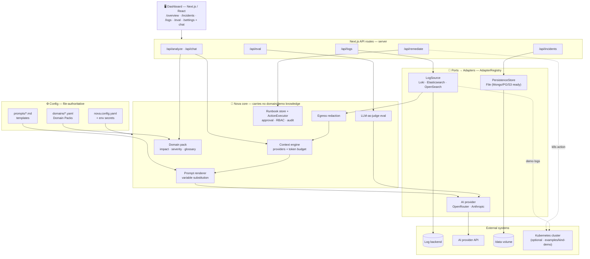

# Nova — AI‑Augmented DevOps Platform

Nova is a **plug‑and‑play, open‑source, AI‑augmented DevOps incident platform**. It reasons
over your **real logs and incidents** to produce root‑cause analyses, a grounded incident
**chat assistant**, and **approve‑to‑run remediation runbooks** — all configured through a
single `nova.config.yaml`.

Everything is pluggable and config‑driven:

- **Logging backend** — Loki or Elasticsearch/OpenSearch (same `LogScope`, no code changes).
- **Persistence** — file store today (Mongo/Postgres/S3 are contract‑ready adapters).
- **AI provider** — OpenRouter / Anthropic (keys stay in env, never in the file).
- **Domain Packs** (`domains/*.yaml`) — swap the vocabulary, services, impact signal and
  severity rules so Nova speaks *your* domain (payments, streaming, generic‑k8s, …).
- **Prompt templates** (`prompts/*.md`) — tune the AI wording without touching code.

Run it three ways: **locally** (`npm run dev`), in **production** (Docker image / Helm
chart / Kubernetes), or via the included **one‑command KinD demo** under
[`examples/kind-demo/`](examples/kind-demo) — see its
[README](examples/kind-demo/README.md).

---

## Table of contents

- [What it does](#what-it-does)
- [Configuration](#configuration)
- [Running locally](#running-locally)
- [Deploy to production](#deploy-to-production)
  - [Docker](#option-1--docker)
  - [Helm / Kubernetes](#option-2--helm--kubernetes)
- [Architecture](#architecture)
- [Adapters & extensibility](#adapters--extensibility)
- [Environment variables](#environment-variables)
- [Testing](#testing)
- [Development](#development)
- [Repository layout](#repository-layout)
- [The included demo (KinD)](#the-included-demo-kind)
- [Security](#security-notes)

---

## What it does

Nova turns raw logs + incidents into grounded, actionable output:

- **Root‑cause analysis** — streams a structured RCA (root cause → blast radius →
  remediation → confidence) from an incident's real logs, using the configured AI provider.
- **Incident chat assistant** — answers time‑range and aggregation questions over your
  incident history, RCAs, runbooks, cluster state and eval scores, grounded only in context.
- **Runbooks** — matches an incident to an authored runbook and offers **approve‑to‑run**
  remediation (manual, webhook, or k8s) behind approval + RBAC + audit.
- **Self‑evaluation** — an on‑demand LLM‑as‑judge harness scores the AI's own output against
  a golden dataset and real incidents (config‑driven weights + pass threshold).
- **Read‑only Settings** at `/settings` — shows the resolved config (secrets never displayed).

The bundled demo drives a real `payment-service` in a local KinD cluster into a
connection‑pool cascade so you can watch the whole flow end‑to‑end — but the **core carries
no demo or domain assumptions** (enforced by `test/architecture/no-demo-imports.test.ts`).

---

## Configuration

Nova reads **`nova.config.yaml`** from the working directory (or the path in `$NOVA_CONFIG`).
It's optional — with no file, built‑in defaults apply. A partial file is fine; every unset
field inherits its default. Start from [`nova.config.example.yaml`](nova.config.example.yaml).

**Secrets never live in the file.** Reference them with `${ENV_VAR}` (with an optional
`${VAR:-fallback}`) and provide the value via the environment:

```yaml
logs:
  provider: loki                 # loki | elasticsearch | opensearch
  url: ${LOKI_URL:-http://loki:3100}
  scope:                         # where Nova looks for logs (backend-neutral)
    include: [{ namespace: production }]
    exclude: [{ service: load-generator }]
persistence:
  provider: file                 # file (Mongo/Postgres/S3 are adapter-ready)
  seed: none                     # 'none' = start empty (default). No demo history ships anymore.
ai:
  provider: openrouter           # openrouter | anthropic | openai | azure | ollama
  apiKeyEnv: OPENROUTER_API_KEY  # the ENV VAR name — the key stays in env
# domain: ./domains/payments.yaml  # optional Domain Pack (else the built-in default)
features:
  chat: true
  eval: true
  autoRemediation: false
```

- **Domain Packs** live in [`domains/`](domains) and are selected with `domain:`. They set the
  glossary, service catalog, impact signal, severity rules and prompt wording — swapping one
  file re‑domains Nova with no code change.
- **Prompt templates** live in [`prompts/`](prompts) (`triage.md`, `rca.md`, `chat-system.md`,
  `judge.md`) and are referenced under `prompts:` in the config.
- The full surface is documented inline in `nova.config.example.yaml`.

### Point Nova at your Prometheus

Nova can source per‑service metrics (CPU, memory, error rate, **p95 latency, RPS**) from a real
Prometheus. Nova is only a **PromQL client** — it queries your existing Prometheus, it never
scrapes (your `ServiceMonitor`/`scrape_configs` own that, and your apps expose `/metrics`).
You declare, in config, which PromQL produces which metric key — so it stays domain‑agnostic:

```yaml
metrics:
  provider: prometheus
  url: ${PROM_URL:-http://prometheus:9090}
  authTokenEnv: PROM_TOKEN         # env var holding a bearer token (optional)
  serviceLabel: service            # PromQL label that identifies the service
  queries:
    errorRate:  'sum by (service)(rate(http_requests_total{code=~"5.."}[5m])) / sum by (service)(rate(http_requests_total[5m])) * 100'
    latencyP95: 'histogram_quantile(0.95, sum by (service,le)(rate(http_request_duration_seconds_bucket[5m]))) * 1000'
    rps:        'sum by (service)(rate(http_requests_total[5m]))'
```

The service‑health table and the latency chart light up automatically when these values exist.
You can also add **custom PromQL stat tiles** under `dashboard.stats.tiles` — each tile’s query
is executed **server‑side** (the browser only references it by `id`, so no free‑form PromQL ever
reaches Prometheus):

```yaml
dashboard:
  stats:
    tiles:
      - { id: db-pool, label: "DB pool", query: "max(db_pool_in_use_percent)", unit: "%", thresholds: { warn: 70, critical: 90 } }
```

---

## Running locally

```bash
npm install

# Optional: start from the example config (defaults work without it)
cp nova.config.example.yaml nova.config.yaml

# Optional: an AI key enables RCA/chat (without one, those features report "no key").
# Copy the env template and fill in what you need — Next.js auto-loads .env.local.
cp .env.local.example .env.local       # then edit .env.local (OPENROUTER_API_KEY, …)

npm run dev                            # http://localhost:3000  → /overview
```

> Prefer not to use a file? Just `export OPENROUTER_API_KEY=sk-...` (or `ANTHROPIC_API_KEY`)
> in your shell instead — see [Environment variables](#environment-variables) for the full list.

What works without extra setup:

- **No config file** → defaults load (Loki at `http://loki:3100`, file store, payments‑reference domain).
- **No AI key** → the dashboard runs; AI actions return a clear "no key configured" message.
- **No log backend reachable** → `/api/logs` returns `{ fallback: true }` and the UI degrades gracefully.

Useful scripts: `npm run build` (production build), `npm run typecheck`, `npm test`.

---

## Deploy to production

Nova is a stateless Next.js server (standalone output) on port **3000**. It needs three things:

1. A **config** (`nova.config.yaml`, mounted or baked in) pointing at your log backend.
2. **Secrets** in the environment (AI key + any backend credentials).
3. **Persistence** — a volume for the file store at `/data` (`DATA_DIR`), or a database
   adapter once configured.

A real deployment starts from a **fresh `dataDir`** (`$DATA_DIR`, default `./data`); Nova
seeds **no demo incidents** — the incident history is empty until real incidents arrive.

The `prompts/` and `domains/` folders are **baked into the image** (traced into the Next.js
standalone output), so they ship automatically.

### Option 1 — Docker

```bash
# Build (multi-stage; produces a small standalone runtime image)
docker build -t your-org/nova:0.1.0 .

# Run
docker run --rm -p 3000:3000 \
  -e OPENROUTER_API_KEY=sk-... \
  -e LOKI_URL=http://loki.observability:3100 \
  -e NOVA_CONFIG=/app/nova.config.yaml \
  -v "$PWD/nova.config.yaml:/app/nova.config.yaml:ro" \
  -v nova-data:/data \
  your-org/nova:0.1.0
```

Open http://localhost:3000/overview.

### Option 2 — Helm / Kubernetes

A production Helm chart ships in [`deploy/helm/nova`](deploy/helm/nova):

```bash
# 1. Build & push the image to your registry
docker build -t ghcr.io/your-org/nova:0.1.0 .
docker push ghcr.io/your-org/nova:0.1.0

# 2. Install — pass the AI key (or point at an existing Secret) and your config
helm install nova deploy/helm/nova \
  --namespace nova --create-namespace \
  --set image.repository=ghcr.io/your-org/nova \
  --set image.tag=0.1.0 \
  --set secret.data.OPENROUTER_API_KEY=sk-... \
  --set-string novaConfig.logs.url='http://loki.observability:3100'
```

The chart provides:

| Concern | How |
|---|---|
| **Config** | `values.novaConfig` is rendered to a ConfigMap and mounted at `/app/nova.config.yaml`; changing it rolls the pods (config checksum annotation). |
| **Secrets** | Set `secret.data.*` (chart creates a Secret) **or** `secret.existingSecret: my-secret` to reference your own. Injected via `envFrom`. |
| **Persistence** | `persistence.enabled` creates a PVC mounted at `/data` for the file store. Disable it when you configure a database adapter. |
| **Networking** | `service` (ClusterIP by default) + optional `ingress` (host + TLS). |
| **Security** | Runs as non‑root uid 1001 with `fsGroup` so it can write `/data`. |

Recommended production settings: `persistence.enabled: true`, `novaConfig.persistence.seed: none`
(start empty, driven by live incidents), and reference AI/backend secrets via
`secret.existingSecret`. See [`deploy/helm/nova/values.yaml`](deploy/helm/nova/values.yaml)
for every option.

> Prefer plain manifests? `helm template nova deploy/helm/nova -f my-values.yaml | kubectl apply -f -`.

---

## Architecture

Nova is a **ports‑and‑adapters** application: a **domain‑agnostic core**, driven entirely by
config, that talks to the outside world only through **interfaces resolved at runtime** from
an `AdapterRegistry`. Swapping a logging backend, a persistence store or a whole domain is a
config change — never a code change.



> Renders natively on GitHub. In VS Code, install the **Markdown Preview Mermaid Support**
> extension to see it in the built‑in preview.

- **Config is file‑authoritative.** `nova.config.yaml` (+ `${ENV}` secrets), Domain Packs and
  prompt templates drive every behaviour; a partial config inherits every default. The
  read‑only `/settings` page shows the resolved config (secrets never displayed).
- **The core is domain‑agnostic.** Impact signal, severity rules, glossary and prompt wording
  all come from the active Domain Pack — `test/architecture/no-demo-imports.test.ts` and the
  domain leak test prove no demo or domain vocabulary is hardcoded in the core.
- **Everything external is a port + adapter.** `LogSource`, `PersistenceStore` and the AI
  provider are interfaces resolved from the registry at runtime; each adapter must pass a
  shared **contract test** before it ships.
- **Grounded and safe.** The context engine assembles a budgeted, **redacted** context for the
  model; runbook remediations run only behind **approval + RBAC + audit**; API keys stay in
  environment variables and never reach the browser.

---

## Adapters & extensibility

Every plug point is an interface resolved from config through an `AdapterRegistry`, so
adding a backend is "implement + register", never a core change:

| Plug point | Interface | Built‑in adapters | Add one |
|---|---|---|---|
| Logs | `LogSource` (`lib/logs/source.ts`) | Loki, Elasticsearch, OpenSearch | implement `queryLogs`, register in `lib/logs/registry.ts` |
| Persistence | `PersistenceStore` (`lib/persistence/store.ts`) | File | pass the shared contract kit `lib/persistence/contract.ts`, register in `lib/persistence/resolve.ts` |
| Domain | Domain Pack (`domains/*.yaml`) | payments, generic‑k8s, streaming | add a YAML file, point `domain:` at it |
| Prompts | Templates (`prompts/*.md`) | triage/rca/chat/judge | edit the file or point `prompts:` at your own |
| Actions | `ActionExecutor` (`lib/actions/executor.ts`) | manual, http‑webhook | register an executor (shell/k8s are opt‑in) |

A new adapter is not "done" until its **contract test suite** is green — that's how
plug‑and‑play is enforced.

---

## Environment variables

Set these in `.env.local` (local dev) or via the deployment env (in‑cluster). All AI keys are
**server‑side only** — never exposed to the browser.

| Variable | Default | Purpose |
|----------|---------|---------|
| `NOVA_CONFIG` | `./nova.config.yaml` | Path to the config file (optional; defaults apply if absent). |
| `OPENROUTER_API_KEY` | — | Preferred AI provider. If set, AI calls use OpenRouter. |
| `OPENROUTER_MODEL` | `anthropic/claude-sonnet-4-6` | Model used via OpenRouter. |
| `ANTHROPIC_API_KEY` | — | Fallback provider (used only if no OpenRouter key). |
| `ANTHROPIC_MODEL` | `claude-sonnet-4-5-20251001` | Model used via Anthropic direct. |
| `LOKI_URL` | `http://loki:3100` | Loki endpoint (also settable via `logs.url` in config). |
| `ELASTICSEARCH_URL` / `ELASTICSEARCH_INDEX` | `http://elasticsearch:9200` / `logs-*` | ES/OpenSearch backend (when `logs.provider` is elasticsearch/opensearch). |
| `DATA_DIR` | `./data` | File-store directory (mount a volume here in production). |
| `METRICS_COLLECTOR_URL` | `http://metrics-collector:3001` | Where `/api/metrics` proxies (demo). |

Secrets are referenced from config via `${ENV_VAR}` and are **server-side only** — never sent
to the browser and never shown in `/settings`. If **neither** AI key is set, AI actions
return a helpful message and the rest of the platform keeps working.

---

## Testing

```bash
npm test           # vitest — unit, contract, characterization + component tests
npm run typecheck  # tsc --noEmit
npm run build      # next build (standalone)
```

The suite favours contract tests (one suite every adapter must pass), characterization tests
that lock behaviour before a refactor, and fixtures over mocks (time and `fetch` are
injected). `test/architecture/no-demo-imports.test.ts` enforces that the core never imports
demo code. CI (`.github/workflows/ci.yml`) runs typecheck → test → build on every push/PR.

---

## Development

```bash
npm run dev            # dashboard at http://localhost:3000
npm run build          # production build (Next.js standalone output)
npm run typecheck      # type-check the Next.js app
npm test               # run the test suite
```

- **Tooling:** Next.js 16 (App Router) · React 19 · TypeScript · Tailwind CSS · shadcn/ui ·
  Recharts · lucide-react · zod · Vitest · `@kubernetes/client-node`.
- The demo micro-services live under `examples/kind-demo/` and are **excluded** from the core
  type‑check and test run (they build independently). The boundary test guarantees the core
  never imports them.
- `components/ui/` holds generated shadcn primitives and is left untouched by convention.

---

## Repository layout

**🖥️ Dashboard — Next.js app**

| Path | Description |
|------|-------------|
| `app/page.tsx` | Redirects `/` → `/overview` |
| `app/overview/` | Main dashboard — stats, charts, service health, AI panel |
| `app/incidents/` | Incident list + `/incidents/[id]` detail page |
| `app/logs/` | Live log viewer |
| `app/api/analyze/` | `POST` — streams the RCA (OpenRouter / Anthropic) |
| `app/api/metrics/` | `GET` — proxies the metrics-collector |
| `app/api/inject/` | `POST` / `DELETE` — create / stop the k6 load Job |
| `components/dashboard/` | Dashboard UI — charts, tables, incident trigger, AI panel |
| `components/ui/` | shadcn/ui primitives _(left untouched by convention)_ |
| `hooks/` | `use-ai-analysis`, `use-real-metrics` |
| `lib/` | Core logic — `config/` (schema + loader + registry), `logs/` (LogSource adapters + scope), `persistence/` (store + contract), `domain/` (Domain Packs), `ai/` (prompts + context engine), `actions/` (runbook executor), `eval/`, `security/` |

**⚙️ Configuration & packs**

| Path | Description |
|------|-------------|
| `nova.config.example.yaml` | Documented example config (copy to `nova.config.yaml`) |
| `domains/` | Domain Packs — payments, generic‑k8s, streaming (+ authored runbooks) |
| `prompts/` | Editable prompt templates — `triage.md`, `rca.md`, `chat-system.md`, `judge.md` |

**📦 Infra & ops**

| Path | Description |
|------|-------------|
| `deploy/helm/nova/` | Production Helm chart (Deployment, ConfigMap, Secret, PVC, Ingress) |
| `Dockerfile` | Nova server image — Next.js standalone (bakes in `prompts/` + `domains/`) |
| `next.config.mjs` | `output: "standalone"` + file tracing for prompts/domains |

**🧪 Demo environment** _(not part of the core)_

| Path | Description |
|------|-------------|
| `examples/kind-demo/` | One‑command KinD demo — micro-services, Helm values and orchestration scripts. See its [README](examples/kind-demo/README.md). |

---

## The included demo (KinD)

A complete, one‑command local demo — a real `payment-service`, Postgres, a full observability
stack (Loki, Fluent Bit, Grafana, Prometheus + Alertmanager) and a k6 load generator that
drives a connection‑pool cascade — lives entirely under
[`examples/kind-demo/`](examples/kind-demo). It is a **backing environment** for Nova, not part
of the core product (the boundary test enforces the app never imports it).

```bash
./examples/kind-demo/scripts/cluster        # create the cluster + deploy infra & observability
./examples/kind-demo/scripts/deploy-app     # deploy the demo workloads
./examples/kind-demo/scripts/inject-failure # trigger the incident
```

See **[`examples/kind-demo/README.md`](examples/kind-demo/README.md)** for the full guide —
prerequisites, the observability (Helm) stack, scripts reference, the incident flow, and
troubleshooting.

---

## Security notes

- API keys are read **only** server‑side (`/api/analyze`, deployment env, `ai-keys` secret)
  and never sent to the browser.
- `examples/kind-demo/k8s/secret.yaml` and `.env.local` are git‑ignored — do not commit real keys.
- The in‑cluster dashboard gets a narrowly‑scoped ServiceAccount (`dashboard-sa`) that can
  only manage Jobs and read pods in the `production` namespace.

---

*AI‑augmented DevOps platform. Runs end‑to‑end on a single laptop.*
