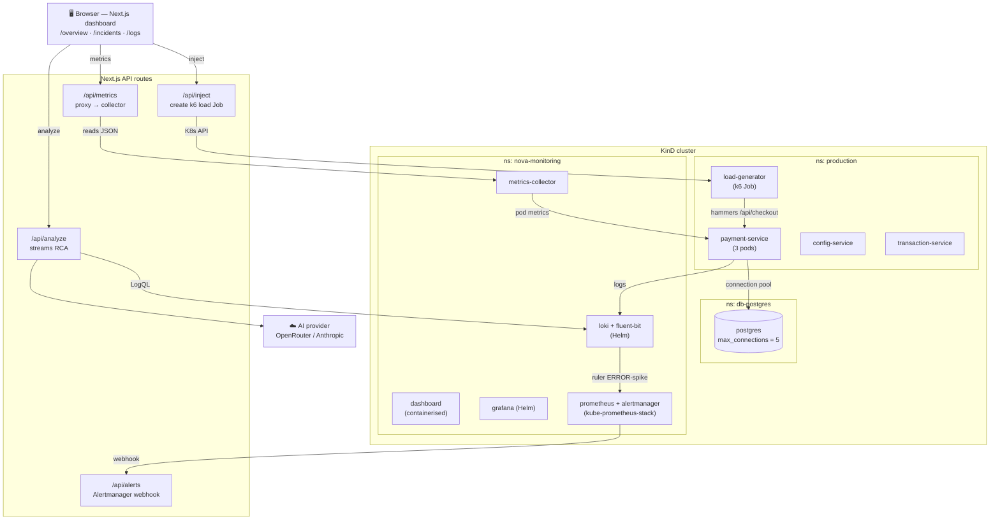
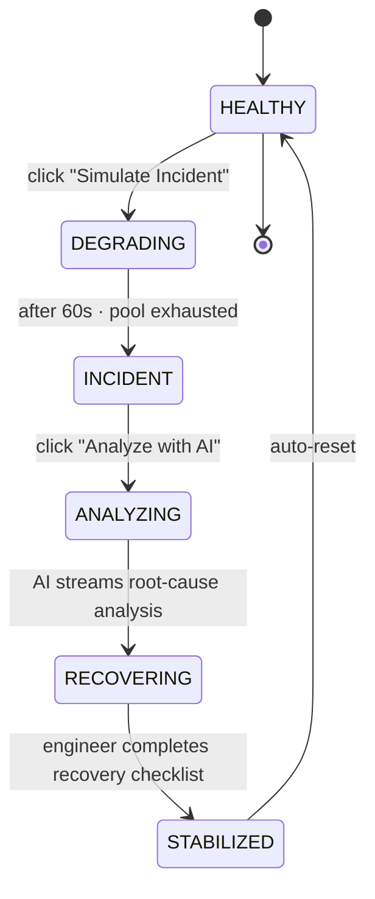

# Nova — KinD Demo

A complete, **one-command local demo** for [Nova](../../README.md). It stands up a real
`payment-service`, Postgres, a full observability stack (Loki, Fluent Bit, Grafana,
Prometheus + Alertmanager) and a k6 load generator in a local **KinD** cluster, then drives a
Postgres connection-pool cascade so you can watch Nova's RCA → chat → remediation flow
end-to-end.

> This demo is a **backing environment** for Nova — not part of the core product. The
> architecture boundary test (`test/architecture/no-demo-imports.test.ts`) enforces that the
> Nova app never imports anything under `examples/kind-demo/`.

---

## Contents

- [Architecture](#architecture)
- [Prerequisites](#prerequisites)
- [Run the demo](#run-the-demo)
- [Observability stack (Helm)](#observability-stack-helm)
- [Scripts reference](#scripts-reference)
- [Services & API routes](#services--api-routes)
- [The incident flow](#the-incident-flow)
- [Live vs. simulated data](#live-vs-simulated-data)
- [Stopping & cleaning up Caddy / mkcert](#stopping--cleaning-up-caddy--mkcert)
- [Troubleshooting](#troubleshooting)

---

## Architecture



In the demo, Nova's `LogSource` adapter is **Loki**: Fluent Bit ships pod logs into Loki with
`{namespace, app, pod}` labels, and Nova pulls the incident window back via LogQL for RCA and
the `/api/logs` viewer. `metrics-collector` aggregates pod health for the service table, a k6
`load-generator` drives the connection-pool cascade that opens `INC-2847`, and the Loki ruler
can fire log-driven alerts through Alertmanager to `/api/alerts`.

---

## Prerequisites

Beyond **Node.js 20+ / npm**, the demo needs:

- [Docker Desktop](https://www.docker.com/products/docker-desktop/) (running)
- [KinD](https://kind.sigs.k8s.io/) — `brew install kind`
- [kubectl](https://kubernetes.io/docs/tasks/tools/) — `brew install kubectl`
- [Helm](https://helm.sh/) — `brew install helm` (the observability stack is Helm-deployed)

**Optional — trusted `https://nova`:** [mkcert](https://github.com/FiloSottile/mkcert) +
[Caddy](https://caddyserver.com/) (`brew install mkcert caddy`) plus a hosts entry:

```bash
sudo sh -c 'echo "127.0.0.1    nova grafana alertmanager" >> /etc/hosts'
```

Without them the demo is still served at `http://localhost:3000`. Built and tested on
**Apple Silicon macOS**.

---

## Run the demo

### 1. (Optional) configure AI keys for the in-cluster dashboard

```bash
cp k8s/secret.yaml.template k8s/secret.yaml
# edit k8s/secret.yaml and fill in OPENROUTER_API_KEY and/or ANTHROPIC_API_KEY
```

`k8s/secret.yaml` is git-ignored. If you skip this, setup creates an empty secret and the AI
panel simply reports that no key is configured.

### 2. Create the cluster + observability stack

```bash
./scripts/cluster
```

Idempotent and safe to re-run. It will:

1. Check prerequisites (docker, kind, kubectl, helm) and add the Helm repos.
2. Create the `nova-platform` KinD cluster (maps container `:30000` → host `:3000`).
3. Install and patch **metrics-server** for KinD.
4. Create the `production`, `db-postgres` + `nova-monitoring` namespaces and the `ai-keys` secret.
5. Build the six images (dashboard, payment-service, metrics-collector, load-generator,
   config-service, transaction-service), **skipping any whose source hasn't changed**
   (stamps in `.build-cache/`).
6. `kind load` each image into the cluster (only when rebuilt or missing).
7. Deploy Postgres + metrics-collector (raw manifests) and the **observability stack via
   Helm** (Loki, Fluent Bit, kube-prometheus-stack, Grafana — see
   [Observability stack](#observability-stack-helm)).
8. Wait for everything to become ready, then run `verify`.
9. **Start the dashboard port-forward** on `localhost:3000` in the background — no manual step.
10. If `mkcert` + `caddy` are installed, install the local CA, generate certs (reused across
    teardowns), and start **Caddy** to serve `https://nova`, `https://grafana` and
    `https://alertmanager`. Binding port 443 prompts for `sudo`.

### 3. Deploy the demo workloads

```bash
./scripts/deploy-app
```

Rolls out `payment-service`, `config-service` and `transaction-service` into the `production`
namespace (Postgres in `db-postgres` is left untouched, so you can redeploy the app without
dropping the database).

### 4. Open the dashboard

`cluster` already started the port-forward (and Caddy, if installed), so just open:

- **https://nova/overview** — if mkcert + Caddy are installed
- **http://localhost:3000/overview** — always available

Grafana (logs deep-dive over Loki) is at **https://grafana** / `http://localhost:3001`.

> Need to (re)start the port-forward manually? `./scripts/port-forward` still works.

### 5. Trigger an incident
∏
```bash
./scripts/inject-failure    # start the k6 load → payment-service degrades in ~20–30s
# …watch the dashboard go red, open INC-2847, click "Analyze with AI", work the checklist…
./scripts/recover           # stop load + scale payment-service 3 → 6 → dashboard goes green
```

Two more failure modes are available: `./scripts/inject-config-failure` and
`./scripts/inject-transaction-failure`.

### 6. Tear down

```bash
./scripts/teardown          # deletes the KinD cluster entirely
```

> **Your certs survive teardown.** `teardown` only deletes the KinD cluster — it never touches
> `certs/`, the mkcert CA, or `/etc/hosts`. On the next `cluster`, the existing cert is reused
> (mkcert is a local, offline CA — no rate limits). The background port-forward and Caddy keep
> running after teardown; stop them with the [cleanup commands](#stopping--cleaning-up-caddy--mkcert).
> Set `HELM_UNINSTALL=1` to `helm uninstall` the observability releases before deleting the
> cluster (normally unnecessary — `kind delete` removes them).

---

## Observability stack (Helm)

The observability components are deployed with Helm using pinned charts and the values files
under [`k8s/`](k8s). Release/full names are pinned so the in-cluster Service DNS stays stable
(`loki:3100`, `grafana:3000`, `alertmanager:9093`) — the dashboard needs no changes.

| Component | Chart (pinned) | Values | Notes |
|---|---|---|---|
| Loki (single-binary + ruler) | `grafana/loki@7.1.0` | [`k8s/loki-values.yaml`](k8s/loki-values.yaml) | filesystem storage; ruler → `alertmanager:9093`; rules from [`k8s/loki-rules.yaml`](k8s/loki-rules.yaml) |
| Fluent Bit | `fluent/fluent-bit@0.57.9` | [`k8s/fluent-bit-values.yaml`](k8s/fluent-bit-values.yaml) | ships `{namespace, app, pod}` labels to Loki |
| Prometheus + Alertmanager | `prometheus-community/kube-prometheus-stack@87.19.0` | [`k8s/prometheus-values.yaml`](k8s/prometheus-values.yaml) | Grafana disabled; only `service`-labeled alerts → Nova webhook |
| Grafana | `grafana/grafana@10.5.15` | [`k8s/grafana-values.yaml`](k8s/grafana-values.yaml) | anon-admin, Loki + Prometheus datasources |

Postgres remains a raw manifest ([`k8s/postgres.yaml`](k8s/postgres.yaml)) — its deliberate
`max_connections=5` misconfiguration is the fault the demo exercises, so it's kept explicit.
The Alertmanager alias Service ([`k8s/alertmanager-alias.yaml`](k8s/alertmanager-alias.yaml))
maps `alertmanager:9093` to the kube-prometheus-stack Alertmanager pod so the Loki ruler and
the port-forward resolve unchanged.

---

## Scripts reference

All scripts live in [`scripts/`](scripts) and are executable. They use `set -e` and are safe
to re-run.

| Script | What it does |
|--------|--------------|
| `cluster` | Creates the cluster, builds/loads images, deploys infra + observability (Helm), verifies, starts the background port-forward, and (if mkcert + caddy are installed) serves `https://nova`. |
| `deploy-app` | Deploys `payment-service`, `config-service`, `transaction-service` into `production` (Postgres in `db-postgres` is left intact). |
| `verify` | Health-checks the cluster (namespaces, deployments, secret, metrics-server). |
| `inject-failure` | Builds/loads the k6 image, runs it as a Job, streams payment-service logs → Postgres pool cascade. |
| `inject-config-failure` | Injects a config-service boot/config failure. |
| `inject-transaction-failure` | Injects a transaction-service failure. |
| `recover` | Stops the load Job, scales `payment-service` 3 → 6, confirms recovery. |
| `verify-impact` | Consistency guard for the single-source customer-impact count across surfaces. |
| `port-forward` | Waits for the dashboard pod, then `kubectl port-forward` to `localhost:3000`. Optional — `cluster` already starts one. |
| `teardown` | Deletes the `nova-platform` KinD cluster. Leaves the port-forward, Caddy, and `certs/` untouched. Honours `HELM_UNINSTALL=1`, `KEEP_IMAGES=1`, `KEEP_DATA=1`. |

> **Force a rebuild:** the build step caches on source mtime via `.build-cache/*.stamp`. To
> force an image rebuild the cache doesn't catch, delete its stamp (e.g.
> `rm .build-cache/dashboard.stamp`) or the image (`docker rmi nova/dashboard:latest`).

---

## Services & API routes

### Next.js API routes (dashboard)
| Route | Method | Purpose |
|-------|--------|---------|
| `/api/analyze` | `POST` | Streams the RCA. Body: `{ logs: string[], context: string }`. Picks OpenRouter if its key is set, else Anthropic. |
| `/api/metrics` | `GET` | Proxies the metrics-collector. `?endpoint=metrics/services`. Returns `{ fallback: true }` (503) when unreachable. |
| `/api/logs` | `GET` | Queries Loki (LogQL). `?service=&since=&until=&levels=&limit=`. Returns `{ fallback: true }` (503) when Loki is unreachable. |
| `/api/alerts` | `POST` | Alertmanager webhook — opens a live incident from a Loki-ruler ERROR-spike alert (idempotent per service). |
| `/api/inject` | `POST` / `DELETE` | Creates / deletes the `load-generator` k6 Job in `production` (needs the `dashboard-sa` RBAC). Fails silently if K8s is unavailable. |

### metrics-collector (`:3001`, standalone Node/TS service)
| Endpoint | Purpose |
|----------|---------|
| `/metrics` | Full cluster state. |
| `/metrics/services` | Per-service aggregated pod metrics. |
| `/health` | Liveness/readiness. |

### payment-service (`:8080`, in-cluster)
`POST /api/checkout`, `GET /health`, `GET /metrics`, `GET /circuit-breaker`. The `/health`
endpoint returns 503 once `errorRate > 50%`, which trips the liveness probe.

---

## The incident flow



- **Browser-driven (no cluster):** the `Simulate Incident` button runs a 90s state machine
  (`lib/live-state.tsx`) — DEGRADING at click, INCIDENT at 60s.
- **Cluster-driven:** the same button also calls `POST /api/inject`, which launches the k6
  load Job so the *real* `payment-service` fails. `recover` (or the checklist narrative)
  restores it.

---

## Live vs. simulated data

The dashboard is designed to be **identical with or without a cluster**:

- **Service health table** shows `LIVE` (green) when `metrics-collector` is reachable and
  overrides matching rows with real pod CPU/memory/error-rate/status/pod-count; otherwise it
  shows `SIMULATED`.
- **Logs page** streams real cluster logs from Loki (`LIVE — cluster logs`); before the first
  poll lands, or when Loki is unreachable, it shows `OFFLINE`. There is no static fallback stream.
- **Incident `INC-2847`** uses real cluster logs for its Related Logs panel and for the AI
  analysis when available (a green `LIVE` / `LIVE LOGS` badge appears); otherwise it uses the
  static incident logs. `INC-2846` / `INC-2845` always use static logs.

All cluster reads go through one poller each (3s interval) and degrade gracefully on error.

---

## Stopping & cleaning up Caddy / mkcert

The port-forward and Caddy run in the background and are **not** stopped by `teardown`.
Stop them (and optionally remove the local HTTPS setup) with:

```bash
sudo caddy stop                              # stop the Caddy reverse proxy
pkill -f "port-forward service/dashboard"    # stop the background port-forward

# Optional — fully remove the local HTTPS trust + certs (only if you won't reuse them):
mkcert -uninstall                            # remove mkcert's local CA from the trust store
rm -rf certs/                                # delete the generated cert + key
# brew uninstall caddy mkcert                # remove the tools entirely
# sudo sed -i '' '/[[:space:]]nova$/d' /etc/hosts   # remove the 127.0.0.1 hosts entry
```

> Keep `certs/` and skip `mkcert -uninstall` if you plan to run the stack again — that's what
> lets the same trusted cert be reused across setups.

---

## Troubleshooting

| Symptom | Fix |
|---------|-----|
| `kind`/`kubectl`/`docker`/`helm` not found | Install them (see [Prerequisites](#prerequisites)); ensure Docker Desktop is running. |
| Dashboard not on `localhost:3000` | Run `./scripts/port-forward` (the pod must be Ready first). Check `/tmp/nova-portforward.log`. |
| `https://nova` not loading | Ensure `mkcert` + `caddy` are installed, `/etc/hosts` has `127.0.0.1 nova`, the port-forward is up (`http://localhost:3000` works), and Caddy is running. Re-run `./scripts/cluster` or `sudo caddy start --config certs/Caddyfile`. |
| Table stuck on `SIMULATED` | `metrics-collector` not reachable — check `kubectl get pods -n production` and `METRICS_COLLECTOR_URL`. The dashboard still works on simulated data. |
| "Analyze with AI" errors | No AI key configured — set `OPENROUTER_API_KEY` (or `ANTHROPIC_API_KEY`) in the `ai-keys` secret. |
| Helm release stuck / failed | `helm -n nova-monitoring status <loki\|grafana\|my-prometheus\|fluent-bit>`; re-run `./scripts/cluster` (installs are idempotent). |
| Image change not picked up | Delete its build stamp in `.build-cache/` or the Docker image, then re-run `cluster`. |
| Re-running `inject-failure` errors | It auto-deletes the prior `load-generator` Job; if a pod lingers, `kubectl delete job load-generator -n production --ignore-not-found`. |
| Reset the incident | Re-run `./scripts/recover` (stops the load Job and scales `payment-service` back to healthy). |
