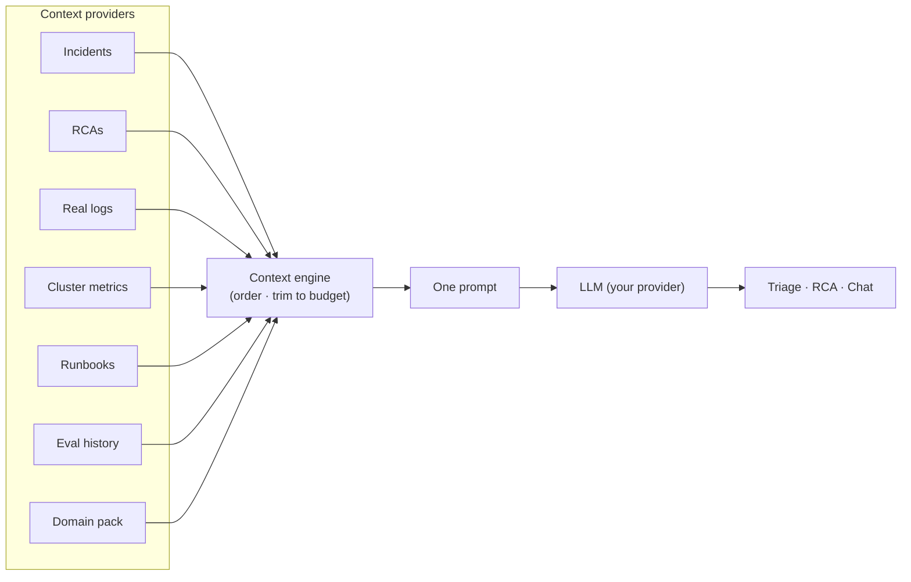

# AI pipeline

Nova's AI is **deterministic by default**: it gathers a curated bundle of real context, packs
it into one prompt, and makes a **single** LLM call for triage, RCA, or chat. This is a
deliberate choice — it's predictable, cheap, reproducible, and unit-testable.

## Context engine

The context isn't one giant function — it's a set of independent **providers**, each turning
the current inputs into one labelled block. The engine orders them by priority and trims to a
token budget (dropping least-important blocks first). Every block is unit-testable in isolation,
and providers can be enabled/reprioritised via config.

## Grounded, not guessing

- The RCA is generated from the incident's **real pod logs** (with the exact evidence persisted
  alongside the document).
- Impact figures, durations, and timelines are derived from real signals — never invented.
- With no AI key, the UI surfaces "AI not configured" instead of fabricating an answer.

## Evaluation

An **LLM-as-judge** harness scores generated RCAs on groundedness and correctness against
golden cases and real incidents, combining deterministic checks with a judge model. Scores are
surfaced in-product so quality is measurable, not vibes.

[:octicons-arrow-right-24: Evaluation harness](../guides/eval.md){ .md-button }

## Roadmap: opt-in "Deep Investigate"

A future **agentic** mode will let the model iteratively call read-only tools (fetch more logs,
run allow-listed PromQL, describe a workload) for novel, cross-system incidents — with hard
guardrails (bounded loop, grounded-or-"I don't know", a full auditable tool-call trace). The
deterministic pipeline stays the default. See the [roadmap](../roadmap.md).
