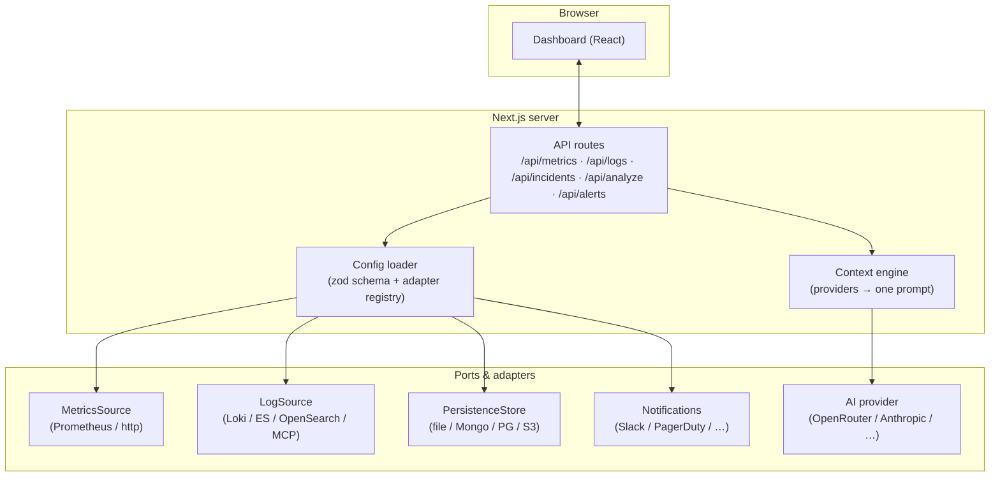

# Architecture

Nova is a stateless Next.js (App Router) server. The browser talks to a small set of API
routes; those routes resolve **ports** to concrete **adapters** based on your config, and
assemble grounded context for the LLM.



## Ports & adapters

Everything external is a **port** (a small TypeScript interface) with one or more **adapters**.
An `AdapterRegistry` maps a `provider` string from your config to a factory:

```ts
metricsSourceRegistry
  .register("prometheus", (cfg) => new PrometheusMetricsSource({ ... }))
// config.metrics.provider === "prometheus"  →  PrometheusMetricsSource
```

Swapping a logging backend, a persistence store, or a metrics source is a **one-line config
change** — no code touched. Adapters that aren't built yet are still declared as typed
contracts, so adding one is self-contained.

| Port | Interface | Built-in adapters |
|---|---|---|
| Metrics | `MetricsSource` | `prometheus`, `http` (collector) |
| Logs | `LogSource` | `loki`, `elasticsearch`, `opensearch`, `mcp` |
| Persistence | `PersistenceStore` | `file` (Mongo / Postgres / S3 contract-ready) |
| AI | provider | `openrouter`, `anthropic`, `openai`, `azure`, `ollama` |
| Notifications | channel | `slack`, `pagerduty`, `msteams`, `webhook`, `email` |

## Single source of truth

The Zod **config schema** is the single source of truth for behaviour. `parse({})` yields the
default config; a partial `nova.config.yaml` is deep-filled; invalid config fails fast with a
descriptive error. A **secret-free projection** is exposed to the browser for the settings and
dashboard config — API keys and credentialed URLs are never sent to the client.

[:octicons-arrow-right-24: Adapters & registry](adapters.md){ .md-button }
