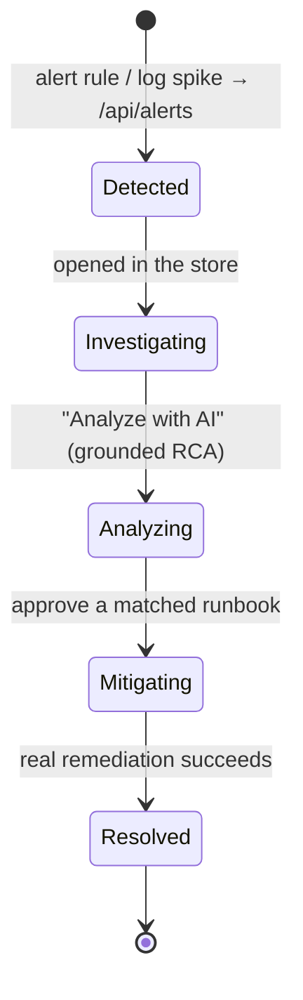

# Incident lifecycle

Incidents in Nova are **real records** in a persistent store — created by real detection,
enriched with real logs, and resolved by real remediation.

## Detection

Nova doesn't invent incidents. They're created by a **generic, source-driven** path: an
alerting rule (e.g. a Loki ruler or Alertmanager) fires when a real threshold is breached and
`POST`s to `/api/alerts`, which opens an incident keyed on the service. The path is idempotent —
one open incident per service — so it coexists with manual injects without duplicates.

## Analysis

Opening an incident shows its real timeline, related logs, and — for an open incident — an
**Analyze with AI** action that streams a grounded RCA from the service's live pod logs. A
**matched runbook** appears when the failure type is recognised, offering a pre-approved fix.

## Resolution

Approving a runbook performs the **real cluster remediation** and, once the service is healthy
again, marks the incident resolved in the store. Every incident's RCA document (and the exact
logs it was generated from) is persisted, so history survives restarts and feeds future context.

## History

The incident store is the memory of the system: past incidents and their RCAs ground future
analysis and power the "ask the incident" assistant.
