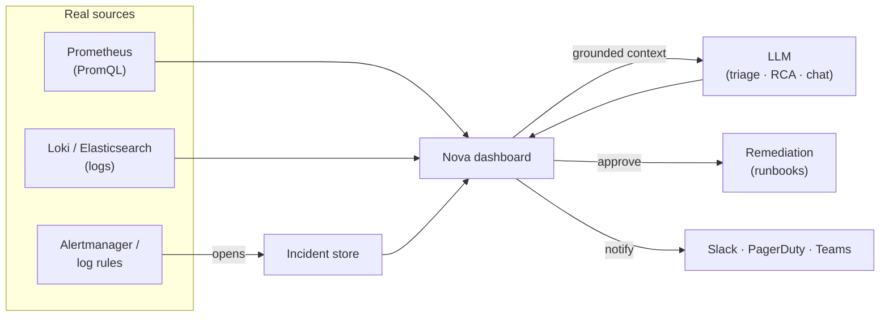

---
hide:
  - navigation
  - toc
---

# Nova

A self-hostable, <strong>UI-first</strong> AI platform for incident detection,
root-cause analysis, and remediation — <strong>config-driven</strong>,
<strong>source-grounded</strong>, and <strong>domain-agnostic</strong>.

[Get started :material-arrow-right:](getting-started/index.md){ .md-button .md-button--primary }
[Why Nova?](concepts/index.md){ .md-button }

---

## What is Nova?

Nova watches your real signals — metrics, logs, and your incident store — detects when
something breaks, and uses an LLM to explain **why** and suggest **how to fix it**, all in a
purpose-built dashboard. Every value on screen comes from a **real source** or shows an
honest empty state. Nothing is faked, scripted, or hardcoded.

It's designed to drop into your stack: point it at your Prometheus, Loki/Elasticsearch, and
AI provider via one typed YAML file, and it adapts to *your* domain — no code changes.

-   :material-view-dashboard-outline:{ .lg .middle } __UI-first__

    ---

    A real dashboard — service health, incidents, streamed RCA, log viewer, and an
    "ask the incident" assistant. Not just a CLI.

    [:octicons-arrow-right-24: Architecture](concepts/architecture.md)

-   :material-tune:{ .lg .middle } __Config-driven adapters__

    ---

    One typed `nova.config.yaml` selects your log backend, metrics source,
    persistence, AI provider, and notifications. Swap a backend with one line.

    [:octicons-arrow-right-24: Adapters](concepts/adapters.md)

-   :material-chart-line:{ .lg .middle } __Real observability__

    ---

    Query your **Prometheus** (PromQL) for latency, RPS and error rates; stream logs
    from **Loki / Elasticsearch**; drive incidents from real alerts.

    [:octicons-arrow-right-24: Prometheus guide](guides/prometheus.md)

-   :material-robot-outline:{ .lg .middle } __Deterministic AI__

    ---

    Curated, grounded context → a single LLM call for triage / RCA / chat.
    Predictable, cheap, reproducible, and unit-tested.

    [:octicons-arrow-right-24: AI pipeline](concepts/ai-pipeline.md)

-   :material-domain:{ .lg .middle } __Domain packs__

    ---

    Ground the AI in *your* world — glossary, service catalog, impact signal,
    runbooks — by pointing at one YAML file. Zero core changes.

    [:octicons-arrow-right-24: Domain packs](concepts/domain-packs.md)

-   :material-kubernetes:{ .lg .middle } __One-command demo__

    ---

    A full local KinD cluster — a real failing service, Prometheus, Loki,
    Alertmanager — to see the whole loop end to end.

    [:octicons-arrow-right-24: Quickstart](getting-started/quickstart.md)

---

## The loop, end to end

---

## Where to next

- :material-rocket-launch-outline: [__Get started__](getting-started/index.md) — install and run the demo
- :material-book-open-variant: [__Concepts__](concepts/index.md) — how Nova is built
- :material-cog-outline: [__Configuration__](getting-started/configuration.md) — the `nova.config.yaml` surface
- :material-map-outline: [__Roadmap__](roadmap.md) — what's next

